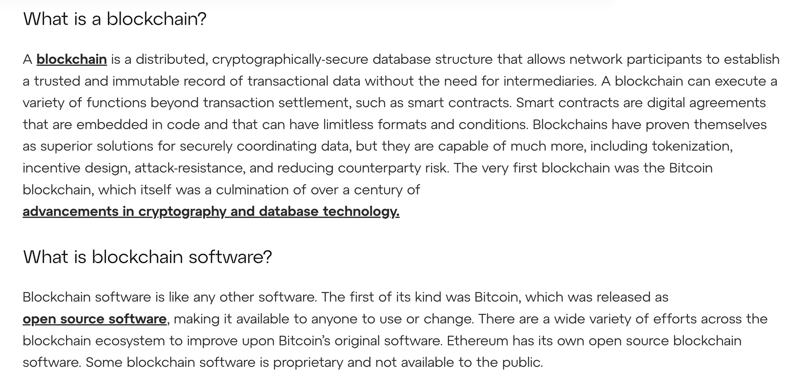

# Build a knowledge base using Gaia web tool

GaiaNet has developed a tool for making vector collection snapshot files, so everyone can easily create their own knowledge base.

Access it here: https://tools.gaianet.xyz/

## Segment your text file

First, copy unformatted text into a txt file. Then follow the two rules to chunk your content, ie putting similar content together.

- Each title and related content are a chunk. There is no blank lines in one chunk.
- Use a blank line to recognize different chunks.

After that, save it as a txt file.

For example, below is your source.



After formatted, it will look like the following.

```
What is a blockchain?
A blockchain is a distributed, cryptographically-secure database structure that allows network participants to establish a trusted and immutable record of transactional data without the need for intermediaries. A blockchain can execute a variety of functions beyond transaction settlement, such as smart contracts. Smart contracts are digital agreements that are embedded in code and that can have limitless formats and conditions. Blockchains have proven themselves as superior solutions for securely coordinating data, but they are capable of much more, including tokenization, incentive design, attack-resistance, and reducing counterparty risk. The very first blockchain was the Bitcoin blockchain, which itself was a culmination of over a century of advancements in cryptography and database technology.

What is blockchain software?
Blockchain software is like any other software. The first of its kind was Bitcoin, which was released as open source software, making it available to anyone to use or change. There are a wide variety of efforts across the blockchain ecosystem to improve upon Bitcoin's original software. Ethereum has its own open source blockchain software. Some blockchain software is proprietary and not available to the public.
```

## Generate the snapshot file

1. Visit this URL: https://tools.gaianet.xyz/, upload the above prepared txt file
2. Edit your `dbname` . ***Note: Do not include spaces or special characters in the dbname***
3. Choose Embedding model, we suggest use `nomic-embed-text-v1.5.f16`
4. Click the "Make RAG" button and wait

When finished, the chatbot will display GaiaNet Node config info. It is a JSON format as follows.

```
{
  "embedding": "https://huggingface.co/gaianet/Nomic-embed-text-v1.5-Embedding-GGUF/resolve/main/nomic-embed-text-v1.5.f16.gguf",
  "embedding_ctx_size": 768,
  "snapshot": "https://huggingface.co/datasets/max-id/gaianet-qdrant-snapshot/resolve/main/test/test.snapshot"
}
```

## Update the node config

Run the following

```
gaianet config \
  --snapshot https://huggingface.co/datasets/max-id/gaianet-qdrant-snapshot/resolve/main/test/test.snapshot \
  --embedding-url https://huggingface.co/gaianet/Nomic-embed-text-v1.5-Embedding-GGUF/resolve/main/nomic-embed-text-v1.5.f16.gguf \
  --embedding-ctx-size 768
```

and then

```
gaianet init
gaianet start
```

Have fun!
