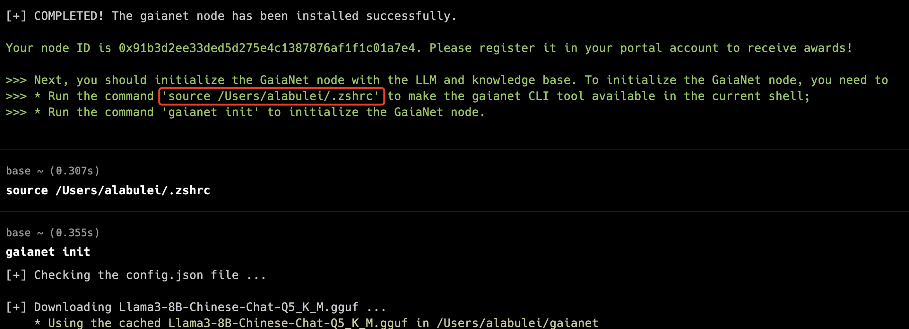

# Quick start with GaiaNet Node

First, let's install GaiaNet an one-line installer on Mac, Linux, or Windows WSL. Learn more about [system requirements](system-requirements).


```
curl -sSfL 'https://raw.githubusercontent.com/GaiaNet-AI/gaianet-node/main/install.sh' | bash
```

Next, run the command printed on the terminal to set up the environment path. The command is started with `source`.





Next, use the following command to initialize the GaiaNet node according to the configuration options 
in `$HOME/gaianet/config.json`.
By default, the GaiaNet is initialized with a [Phi-3](https://azure.microsoft.com/en-us/blog/introducing-phi-3-redefining-whats-possible-with-slms/) LLM and a [knowledge base about Paris](https://huggingface.co/datasets/gaianet/paris). 
This command could take some time since it will download  a very large LLM file.

```
gaianet init
```

Finally, start your node.

```
gaianet start
```

Upon a successful start, the command prints a public URL for the node. You can open a browser to that URL to see the node information and then chat with the AI agent on the node.

```
... ... https://0xf63939431ee11267f4855a166e11cc44d24960c0.gaianet.xyz
```

The following command stops the node.

```
gaianet stop
```

## Next steps

* [Customize](customize) your node. You probably do not wish to just run the default Phi-3 model and Paris knowledge base. 
* [Register](register) and join the GaiaNet protocol network to receive payments.
* [Protect](tasks/protect) the node server to ensure stable service.
* Install and manage [multiple nodes](tasks/multiple) on a single machine.

