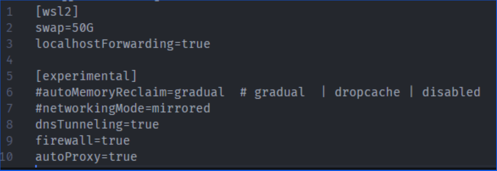
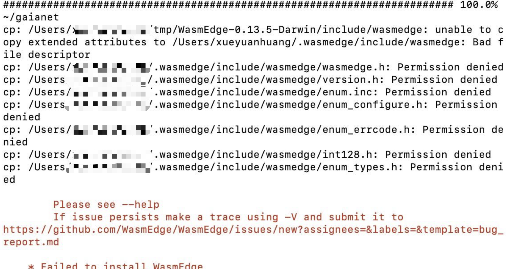

# Troubleshooting

## The system cannot find CUDA libraries

Sometimes, the CUDA toolkit is installed in a non-standard location. The error message here is often not able to find `libcu*12`. For example, you might have CUDA installed with your Python setup. The following command would install CUDA into Python's enviornment.

```
sudo apt install python3-pip -y
pip3 install --upgrade fschat accelerate autoawq vllm
```

The easiest way to fix is simply to link those non-standard CUDA libraries to the standard location, like this.

```
ln -s /usr/local/lib/python3.10/dist-packages/nvidia/cublas/lib/libcublas.so.12 /usr/lib/libcublas.so.12
ln -s /usr/local/lib/python3.10/dist-packages/nvidia/cuda_runtime/lib/libcudart.so.12 /usr/lib/libcudart.so.12
ln -s /usr/local/lib/python3.10/dist-packages/nvidia/cublas/lib/libcublasLt.so.12 /usr/lib/libcublasLt.so.12
```

## Failed to recover from collection snapshot on Windows WSL

On Windows WSL, you could see this error while running `gaianet init`.

```
   * Import the Qdrant collection snapshot ...
      The process may take a few minutes. Please wait ...
    * [Error] Failed to recover from the collection snapshot. {"status":{"error":"Service internal error: Tokio task join error: task 1242 panicked"},"time":0.697784244}
```

When you look into the `~/gaianet/log/init-qdrant.log` file, you could see this line of error

```
2024-05-20T07:24:52.900895Z ERROR qdrant::startup: Panic occurred in file /home/runner/.cargo/registry/src/index.crates.io-6f17d22bba15001f/cgroups-rs-0.3.4/src/memory.rs at line 587: called `Result::unwrap()` on an `Err` value: Error { kind: ReadFailed("/sys/fs/cgroup/memory.high"), cause: Some(Os { code: 2, kind: NotFound, message: "No such file or directory" }) }  
```

The solution is to disable the `autoMemoryReclaim` feature in WSL. Step to turn on/off this feature:

1. Edit `C:\Users<Your user name>.wslconfig`
2. Remove or comment out `autoMemoryReclaim` in `[experimental]` section.



Thanks to [RoggeOhta](https://github.com/RoggeOhta) for discovering this. You can learn more about it [here](https://github.com/GaiaNet-AI/gaianet-node/issues/46).

## Load library failed: libgomp.so.1: cannot open shared object file: No such file or directory


On Windows WSL, you may see this error when running `curl -sSfL 'https://github.com/GaiaNet-AI/gaianet-node/releases/latest/download/install.sh' | bash`

```
* Generate node IS
[2024-07-02 17:50:55.175] [error] loading failed: invalid path, Code: 0x20
[2024-07-02 17:50:55.175] [error]   Load library failed: libgomp.so.1: cannot open shared object file: No such file or directory
[2024-07-02 17:50:55.176] [error] loading failed: invalid path, Code: 0x20
[2024-07-02 17:50:55.176] [error]   Load library failed: libgomp.so.1: cannot open shared object file: No such file or directory
```
The error is caused by the lack of `libgomp.so.1`, a library that should be automatically installed on Ubuntu by default.

To solve this, you must install the `libgomp.so.1` library.

```
sudo apt-get update
sudo apt-get install libgomp1
```

If you're using CentOS, you can use

```
yum install libgomp
```

This issue will be fixed in the upcoming days.

## Failed to remove the default collection

```
Failed to remove the default collection. {"status":{"error":"Service internal error: No such file or directory (os error 2)"},"time":0.050924542}
```

It typically indicates that the Qdrant instance was not shut down properly before you try to init it again with a new snapshot. The solution is to stop the GaiaNet node first.

```
gaianet stop
```

Alternatively, you could mannually kill the processes from the terminal or in the OS's Actvity Monitor.

```
sudo pkill -9 qdrant
sudo pkill -9 wasmedge
sudo pkill -9 frpc
```

Then you can run `gaianet init` and then `gaianet start` again.

## File I/O error

```
    * Import the Qdrant collection snapshot ...
      The process may take a few minutes. Please wait ...
    * [Error] Failed to recover from the collection snapshot. An error occurred processing field `snapshot`: File I/O error: Operation not permitted (os error 1) 
```

It typically indicates that the Qdrant instance was not shut down properly before you try to init it again with a new snapshot. The solution is to stop the GaiaNet node first. 

```
gaianet stop
```

Alternatively, you could mannually kill the processes from the terminal or in the OS's Actvity Monitor.

```
sudo pkill -9 qdrant
sudo pkill -9 wasmedge
sudo pkill -9 frpc
```

Then you can run `gaianet init` and then `gaianet start` again.

## The "Failed to open the file" Error

```
Warning: Failed to open the file 
Warning: https://huggingface.co/datasets/max-id/gaianet-qdrant-snapshot/resolve
Warning: /main/consensus/consensus.snapshot: No such file or directory
curl: (23) Failure writing output to destination
```

The reason for this type of error is a mis-configured `config.json` file. The solution is to delete the comments in `config.json` and re-run the `gaianet init` command.

## The "Too many open files" Error on macOS

When running `gaianet init` to initialize a new node on macOS, you may encounter an error related to snapshot recovery if your snapshot contains a large amount of text. The error message may be the following:

```
 * [Error] Failed to recover from the collection snapshot. {"status":{"error":"Service internal error: Too many open files (os error 24)"},"time":1.574064833}
    * [Error] Failed to recover from the collection snapshot. {"status":{"error":"Service internal error: Too many open files (os error 24)"},"time":1.574064833}
```

This issue is caused by the default file descriptor (FD) limit on macOS, which is set to a relatively low value of 256.

To resolve this issue, you can increase the default FD limit on your system. To do so, run the following command:

```
ulimit -n 10000
```

This will temporarily set the FD limit to 10,000. Next, use `gaianet init` and `gaianet start` commands in the SAME terminal.

## Permission denied when use the installer script to install WasmEdge
When running `curl -sSfL 'https://github.com/GaiaNet-AI/gaianet-node/releases/latest/download/install.sh' | bash` to install GaiaNet node software, you may meet the permisson denied error especially installing the WasmEdge runtime. 



This error is caused by the lack of `/tmp` write permission. You can use `--tmpdir` to specify where you want to install the WasmEdge runtime. Please note, you will need to have written permission to the `<YOUR_PATH>` folder.

```
curl -sSfL 'https://github.com/GaiaNet-AI/gaianet-node/releases/latest/download/install.sh' | bash -s -- --tmpdir YOUR_PATH
```


