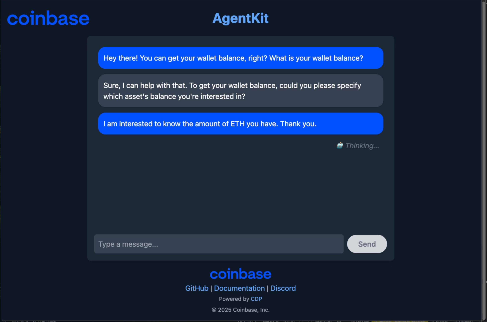

# Agentkit starter- Coinbase Developer Platform

## Overview

This project shows an onchain agent powered by Coinbase's AgentKit with the Next.js framework on the frontend and LangGraph for the agent's setup. The agent is designed for AI-driven on-chain capabilities.

AgentKit handles these interactions by using a Gaia node for Large Language Model (LLM) inferencing.



## Features

- **AI-Driven on-chain interactions**: Leverages AgentKit to enable AI agents to perform actions on blockchain networks.

- **Bootstrapped**: Built as a Next.js project with a LangGraph in the server, bootstrapped with `npm create onchain-agent@latest`.

- **Configurable LLM**: Supports integration with LLMs hosted on Gaia nodes, specifically configured for tool use inferencing (e.g., [Llama-3-Groq-8B-Tool](https://github.com/GaiaNet-AI/node-configs/tree/main/llama-3-groq-8b-tool), [Llama-3.3-70B-Instruct-Q5_K_M](https://llama70b.gaia.domains/v1/info)).

- **Wallet management**: Integrates with a `SmartWalletProvider` for blockchain interactions, with persistent wallet data management.

- **Extensible actions**: Utilizes various Action Providers (e.g., WETH, Pyth, ERC20, CDP API, Wallet actions) to define the agent's capabilities.

- **Chat interface**: Provides a user-friendly chat interface for interacting with the agent.

- **Streamed responses**: Agent responses are streamed for a more interactive user experience.

- **Memory**: Incorporates memory for conversations using `MemorySaver` from LangGraph.

## Getting started

### Prerequisites

1. Node.js 18 or later is installed
2. Confirm that npm 9 or later is installed

Check your Node.js and npm versions:

```bash
node --version  # Should be 18+
npm --version   # Should be 9+
```

3. You can use either a public Gaia node for example: [https://llama70b.gaia.domains/v1](https://llama70b.gaia.domains/v1) or [run the node locally](https://github.com/GaiaNet-AI/node-configs/tree/main/llama-3-groq-8b-tool).

### Creating a new project

You can use the CLI to bootsrap a new Agenkit project with the command below:

```bash
npm create onchain-agent@latest
```

Follow the instructions on the CLI to setup your project and choose the Smart wallet (default) option for the setup. You can also make a framework choice among:

- LangChain
- Vercel AI SDK
- Model Context Protocol (MCP)

In this guide, we cover using the LangChain option.

### Configure secrets and values

Rename the `.env.example` to `.env` and ensure that you have the below values:

```bash
CDP_API_KEY_NAME=
CDP_API_KEY_PRIVATE_KEY=

# Optional
NETWORK_ID=base-sepolia
```

To obtain the values for `CDP_API_KEY_NAME` and `CDP_API_KEY_PRIVATE_KEY` head over to [CDP portal](https://portal.cdp.coinbase.com/projects/api-keys) to create a new API key. Copy the API key name and private key values from the modal that appears.

The `NETWORK_ID` can stay as `base-sepolia` and you can explore the possible [network options](https://docs.cdp.coinbase.com/api/docs/networks#network-identifiers) as well.

## Project structure

```bash
└── tobysolutions-agentkit-gaia-setup/
    ├── README.md
    ├── next-env.d.ts
    ├── next.config.js
    ├── package.json
    ├── postcss.config.mjs
    ├── tailwind.config.ts
    ├── tsconfig.json
    ├── wallet_data.txt
    ├── .eslintrc.json
    ├── .npmignore
    ├── .yarnrc.yml
    └── app/
        ├── globals.css
        ├── layout.tsx
        ├── page.tsx
        ├── api/
        │   └── agent/
        │       ├── create-agent.ts
        │       ├── prepare-agentkit.ts
        │       └── route.ts
        ├── hooks/
        │   └── useAgent.ts
        └── types/
            └── api.ts
```

## Gaia Integration

:::info
Local nodes do not require API ketys. You will need a [Gaia API key](https://www.gaianet.ai/setting/gaia-api-keys) to use public nodes.
:::

The LLM inferencing is offloaded to a Gaia node: 

- The LLM is configured in `app/api/agent/create-agent.ts`.
- The project uses `ChatOpenAI` from `@langchain/openai` to connect to the Gaia node.
- The specific model configured is "Llama-3-Groq-8B-Tool".
- The Gaia node endpoint is set via the `baseURL` in the `ChatOpenAI` configuration:

For example with a local node running on a machine:

```ts
const llm = new ChatOpenAI({
  model: "Llama-3-Groq-8B-Tool",
  configuration: {
    baseURL: "https://0xf446b24f8bb10d479d76456f11a5643246d6fe5a.gaia.domains/v1", // Gaia node URL
    apiKey: "gaia", // API key for the Gaia node (if required)
  },
});
```

## Documentation
For further information and advanced topics, refer to the following official documentation:

- **AgentKit Documentation**:
    - GitHub: https://github.com/coinbase/agentkit
    - CDP Docs: https://docs.cdp.coinbase.com/agentkit/docs/welcome

- **GaiaNet Documentation**:
    - Gaia Node Setup (example Llama-3-Groq-8B-Tool): https://github.com/GaiaNet-AI/node-configs/tree/main/llama-3-groq-8b-tool

- **Coinbase Developer Platform (CDP)**: https://docs.cdp.coinbase.com/

