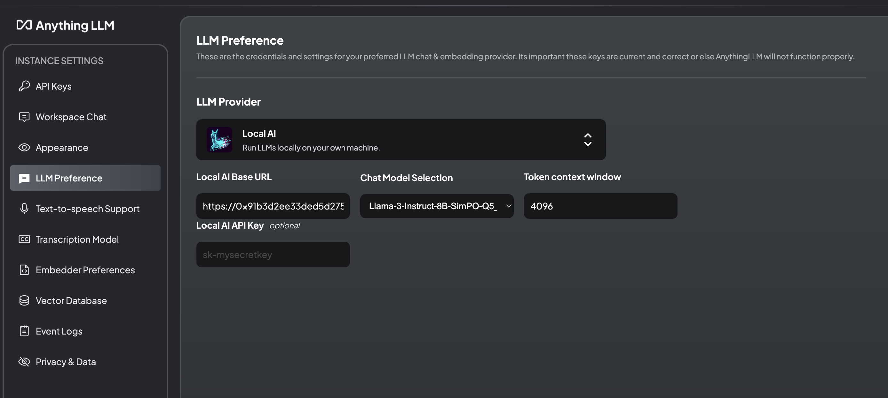
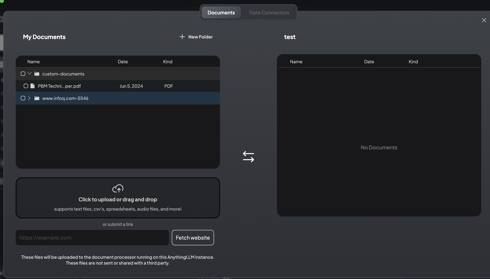
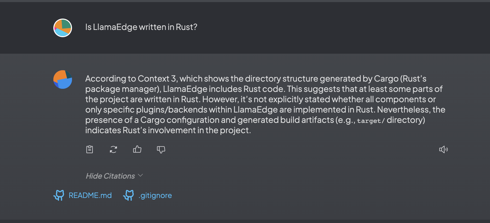

# Anything LLM

Anything LLM is the all-in-one Desktop & Docker AI application with full RAG and AI Agent capabilities. You can configure Anything LLM using the GaiaNet node as the LLM backend. 

It's recommended to start a node without any snapshots, like [this one](https://github.com/GaiaNet-AI/node-configs/tree/main/llama-3-8b-instruct).

## Steps

First, we will need to add GaiaNet Node as the LLM chat model and embedding model.

* Go to Settings
* Choose Local AI as the LLM provider in the LLM inference section. Then copy and paste the GaiaNet node API base URL in the LocalAI Base URL. The chat model and embedding model along with your node will be loaded automatically. Choose the chat model here and input the context length. Remember to click on Save Changes to make the changes take effect.

* Then go to the Embedding Preference section and choose LocalAI as the embedding provider. Then copy and paste the GaiaNet node API base URL in the LocalAI Base URL. The chat model and embedding model along with your node will be loaded automatically. Choose the embedding model here and input the max embedding chunk length. Don't forget to click on Save Changes to make the changes take effect.

The above operations make the Gaianet node as the LLM backend.

Second, let's set up the data source. You can upload a file or use the data connectors provided by Anything LLM.

When you move a data source to the workspace, Anything LLM will call the GaiaNet node's embedding API to chunk and compute embeddings for your documentation, which may take some minutes.

That's it. When the embedding is done, go back to your workspace and ask a question. 

> You can check out the `start-llamaedge.log` to check what happens.
