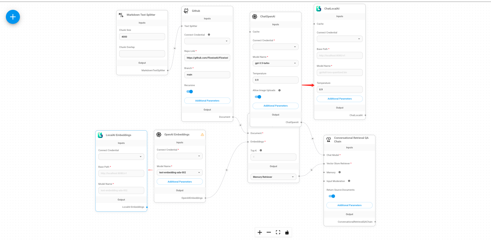
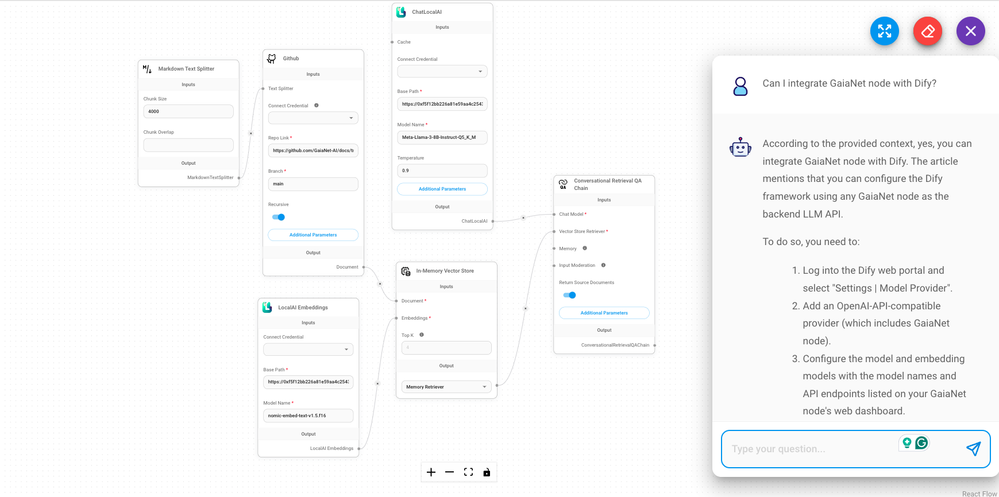

# FlowiseAI + GaiaNet

FlowiseAI is a low-code tool for developers to build customized LLM orchestration flows & AI agents. You can configure the Flowise tool using any Gaianet Node as the backend LLM API.


## Start the FlowiseAI

Follow [the FlowiseAI guide](https://docs.flowiseai.com/getting-started) to install Flowise locally

```
npm install -g flowise
npx flowise start
```

After running successfully, you can open http://localhost:3000 to check out the Flowise AI tool.

## Steps for building a GitHub Docs QnA chatbot

FlowiseAI allows you to combine all the components to build a workflow agent. If you're new to FlowiseAI, it's recommended to use a template quick start. In fact, there are lots of templates around OpenAI in the Flowise marketplace. All we need to do is to replace the ChatOpenAI component with the ChatLocalAI component.

Let's take the ***Flowise Docs QnA* as an example. You can build a QnA chatbot based on your documentation. The original template was built with OpenAI and we will now change it to use an open-source LLM on a GaiaNet node.

### Set up the Chat model

You will need to delete the ChatOpenAI component, and click the + button to search ChatLocalAI and then drag the ChatLocalAI to the screen.



Then, you will need to input the GaiaNet node base URL `https://node_id.us.gaianet.network/v1` and the model name. You can get the model via the following command line.

```
# Replace your node id here

curl -X POST https://node_id.us.gaianet.network/v1/models
```

Next, connect the ChatLocalAI component with the field `Chat model` in the **Conversational Retrieval QA Chain** component.

### Set up the embedding model

This template also uses the OpenAI Embeddings component to create embeddings for your documentation. Hence, we need to replace the **OpenAI Embeddings** component with the **LocalAI Embeddings** component.

* Use the GaiaNet node base URL `https://node_id.us.gaianet.network/v1` in the Base Path field.
* Input the model name in the Model Name field.

Next, connect the **LocalAI Embeddings** component with the field `embedding` in the **In-Mempory Vector Store** component.

### Set up your documentation

Then, let's go through the GitHub component. You will need to put your docs GitHub link into the **Repo Link** field. For example, you can put GaiaNet's docs link: `https://github.com/GaiaNet-AI/docs/tree/main/docs`.

### Give it a try

You can send a question like "How to install a GaiaNet node" after saving the current chatflow. 



And you will get the answer based on the GaiaNet docs, which is more accurate.


## More examples

There are lots of examples on the Flowise marketplace. To build a Flowise agent based on GaiaNet, simply replace the **Chat OpenAI** and **OpenAI Embeddings** component with the GaiaNet base URL.


