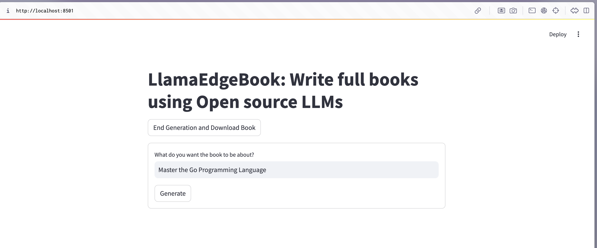
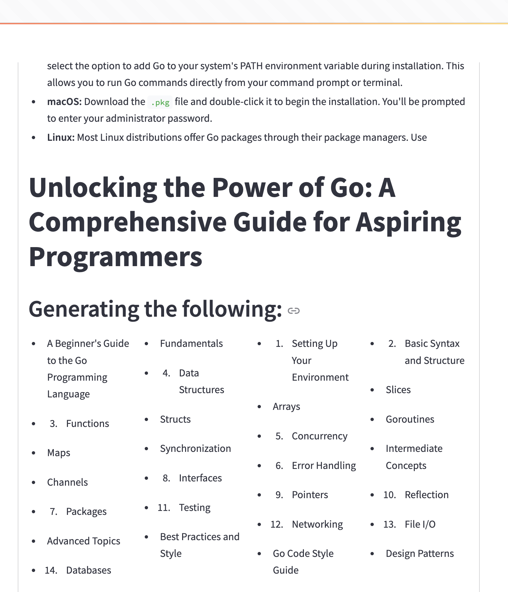
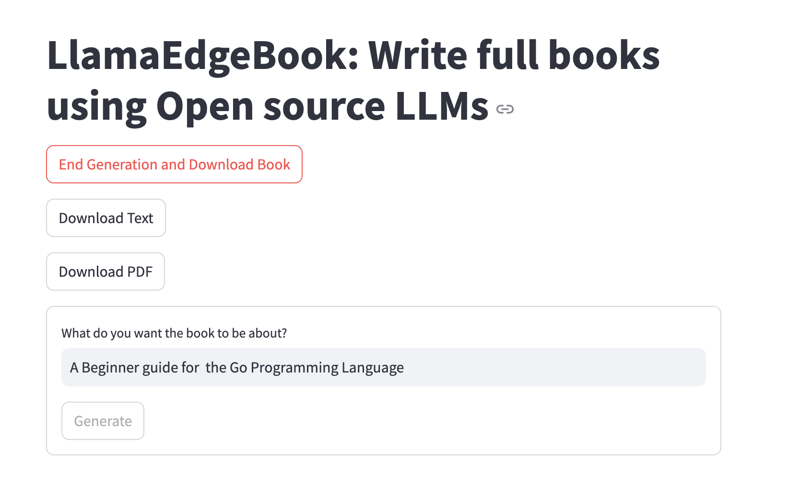

# LlamaEdgeBook

LlamaEdgeBook, forked from GroqBook, is an open-source tool that scaffolds the creation of books from a one-line prompt using open-source LLMs. You can configure the LlamaEdgeBook framework using any GaiaNet node as the backend LLM API.

## Steps

First, get the source code of the LlamaEdgeBook. Open your terminal and enter the following command line.

```
git clone https://github.com/second-state/LlamaEdgeBook
cd LlamaEdgeBook
```

Ensure you have Python 3.11 or later installed. Then, install the necessary packages:

```
pip install -r requirements.txt
```

Next, let's configure the GaiaNet node as the LLM backend.

```
export OPENAI_BASE_URL="https://gemma-2-27b.us.gaianet.network/v1"
export OPENAI_MODEL_NAME="gemma-2-27b-it-Q5_K_M" 
export OPENAI_API_KEY="GAIANET" 
```

**Hint:** if you don't know the model name of the GaiaNet node, you can retrieve the model information using:

```
curl -X POST https://0x57b00e4f3d040e28dc8aabdbe201212e5fb60ebc.us.gaianet.network/v1/models
```

Then, use the following command line to run the app.

```
streamlit run main.py
```

When the app runs successfully, the terminal will output the following information.

```
Collecting usage statistics. To deactivate, set browser.gatherUsageStats to false.

  You can now view your Streamlit app in your browser.

  Local URL: http://localhost:8501
  Network URL: http://10.128.0.8:8501
  External URL: http://35.222.115.181:8501
```

Finally, you can open the `http://localhost:8501` in your browser to generate a book.




The LlamaEdgeBook will first generate an outline based on your prompt, and then create the chapter content based on the outline.



You can also download the book after the generation is complete.




