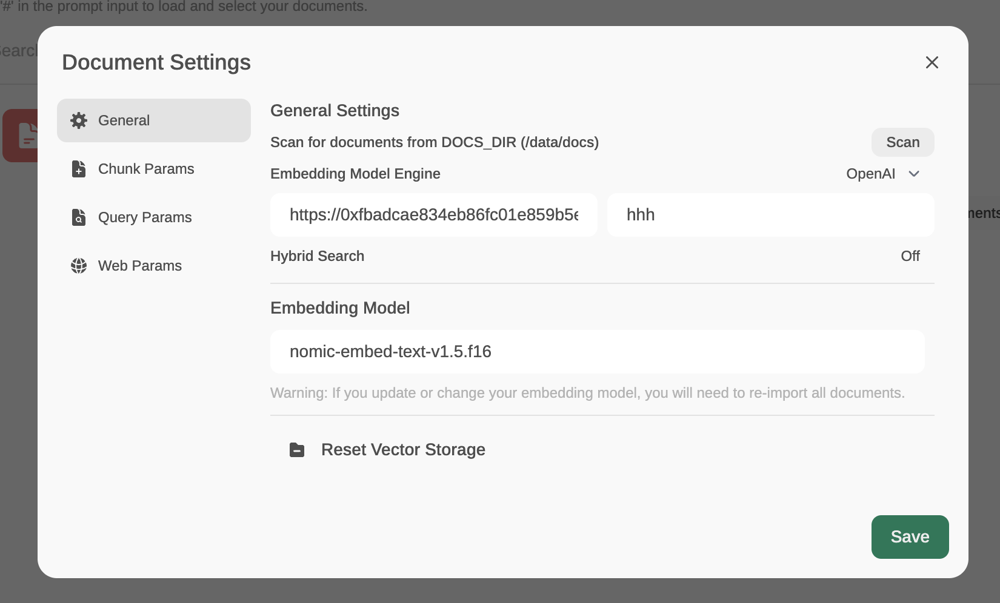

# Open WebUI

You can configure the Open WebUI framework, a self-hosted WebUI, using any GaiaNet node as the backend LLM API. That allows you to use your own
or community GaiaNet nodes in any application built on Open WebUI.

## Prerequisites

You will need a Gaia node ready to provide LLM services through a public URL. You can

* [run your own node](../../node-guide/quick-start.md)
* [use a public node](../nodes.md)

In this tutorial, we will use public nodes to power the Continue plugin.

| Model type | API base URL | Model name |
|-----|--------|-----|
| Chat | https://llama.us.gaianet.network/v1 | llama |
| Embedding | https://llama.us.gaianet.network/v1 | nomic |

## Start the Open WebUI on your machine

After successfully starting the GaiaNet node, you can use `docker run` to start the Open WebUI.

```
docker run -d -p 3000:8080 \
  -v open-webui:/app/backend/data \
  -e OPENAI_API_BASE_URL="https://llama.us.gaianet.network/v1" \
  -e OPENAI_API_KEYS="gaianet" \
  --name open-webui \
  --restart always \
  ghcr.io/open-webui/open-webui:main
```

Then, open `http://localhost:3000` in your browser and you will see the Open WebUI page.

You can also configure your own node when the webUI is started. 

* Click on your profile on the top right corner and choose **Setting**.
* Then choose Connections. In the OpenAI API field, type your node base URL and enter several random characters.
* Click on Save to make the change take effective.


## Use Open WebUI as a Chatbot UI

Simply choose the chat model under **Select a model** and then you can send messages to the GaiaNet node.


## Use Open WebUI as a client-side RAG tool

Open WebUI also offers a way to implment RAG application. Since the Gaianet nodes have OpenAI-compatible embedding APIs, you can also use this feature. However, to use this feature, it's recommend to start a node without any snapshots, like [this one](https://github.com/GaiaNet-AI/node-configs/tree/main/llama-3-8b-instruct).

**Step 1:** Use GaiaNet node as the embedding API

* Click on **Workspace** on left top and choose **Documents** tab. This is where you mange the uploaded documents.
* Click on **Document Settings** to configure the embedding setting.
* In the **General Settings**, choose OpenAI as the Embedding Model Engine. Enter the node API base URL and several random characters. Then, enter the embedding model name in the Embedding Model field. Click Save to apply the changes.



**Step 2:** Use GaiaNet node as the embedding API

Click on **+** to upload your documentations.

**Step 3:** Chat

Then go back to the chat page. Before you send a message, type **#** to choose the document you want to as the context.


That's it.
