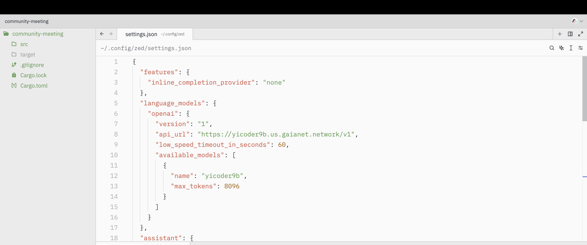
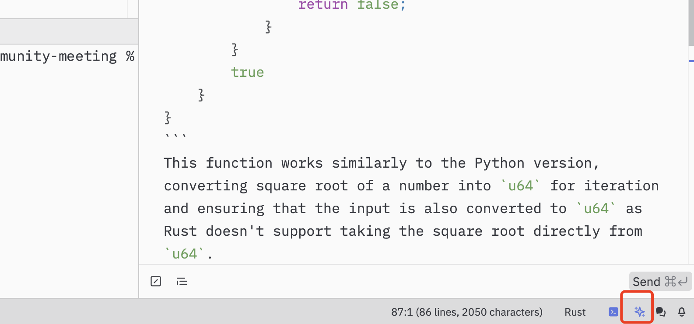
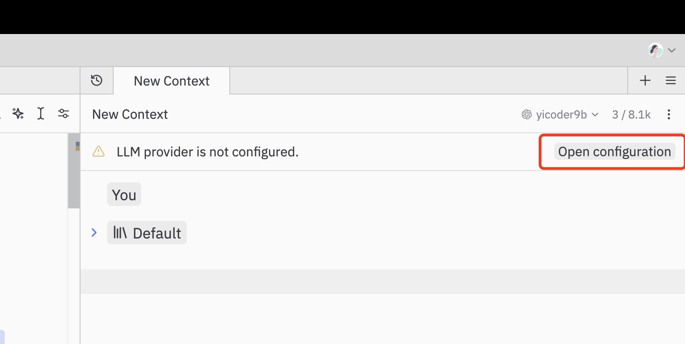
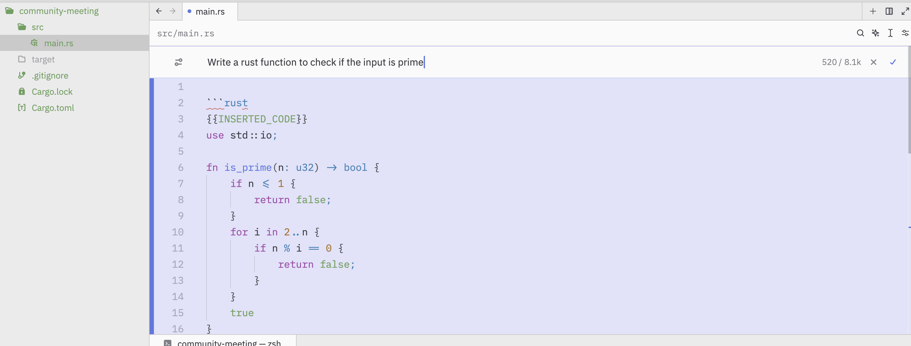
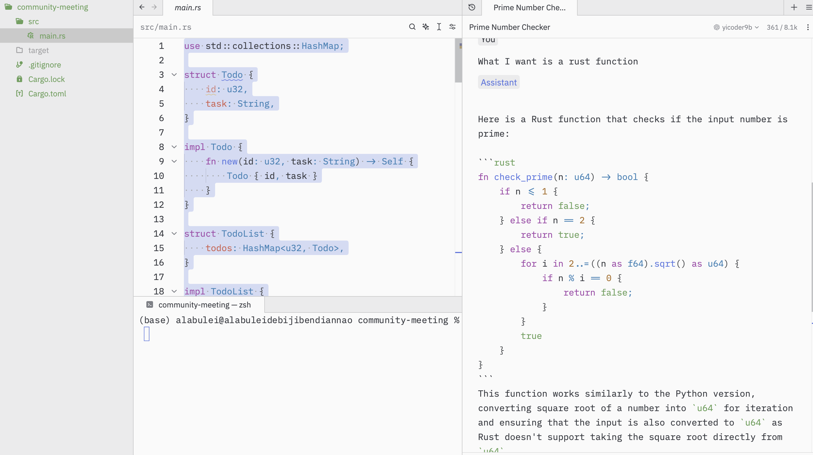

# Zed


Zed is a next-generation code editor designed for high-performance collaboration with humans and AI, and it is written in Rust.  You can use Zed with your own Gaia node as the LLM backend. There are two big reasons for that

* Your Gaia node could be supplemented by a knowledge base that is specific to your proprietary code repository, programming language choices, and coding guidelines/styles.
* Your Gaia node could ensure that your code stays private within your organization.

## Prerequisites

You will need a Gaia node to provide LLM services to Zed. You can

* [run your own node](../../node-guide/quick-start.md)
* [use a public node](../nodes.md)

In this tutorial, we will use the public [Yi-coder-9B node](https://github.com/GaiaNet-AI/node-configs/tree/main/yi-coder-9b-chat) to power Zed.

| Model type | API base URL | Model name |
|-----|--------|-----|
| Chat | https://yicoder9b.us.gaianet.network/v1 | yicoder9b |

> You can start a local LLM service using [Gaia](https://github.com/GaiaNet-AI/node-configs/tree/main/yi-coder-9b-chat) or [LlamaEdge](https://llamaedge.com/docs/user-guide/quick-start-command) or [Moxin](https://github.com/moxin-org/moxin), and then use `http://localhost:8080/v1/` as the LLM API service endpoint URL.

## Configure Zed

First, download and install [Zed](https://zed.dev/). Click on your profile on the top right and choose **Setting**. Then a new tab called `settings.json` will be opened. You can configure your Zed by editing this file.



Clear the existing content, and copy and paste the following JSON file. Please don't forget to save the file.

```
{
  "features": {
    "inline_completion_provider": "none"
  },
  "language_models": {
    "openai": {
      "version": "1",
      "api_url": "https://yicoder9b.us.gaianet.network/v1",
      "low_speed_timeout_in_seconds": 60,
      "available_models": [
        {
          "name": "yicoder9b",
          "max_tokens": 8096
        }
      ]
    }
  },
  "assistant": {
    "provider": "openai",
    "default_model": {
      "provider": "openai",
      "model": "yicoder9b"
    },
    "version": "2"
  },
  "ui_font_size": 16,
  "buffer_font_size": 16,
  "theme": {
    "mode": "system",
    "light": "One Light",
    "dark": "One Dark"
  }
}
```


We have already added the model and base URL in the above step, next we will configure the API key part.

* Go back to the folder you opened. Click on the Star icon at the bottom to turn on the Assistant panel.
  


* Click on **Open configuration** to set up the API Key.
  


* Enter several random characters in the OpenAI section, which is the last one on the screen.

Now, we have everything ready.

# Use Zed

You can

* Edit the highlighted code by selecting the code and clicking on the **Inline Assistant** button.



* Open the Assistant panel by clicking on the **Assistant** icon at the bottom to turn on the Assistant panel.




